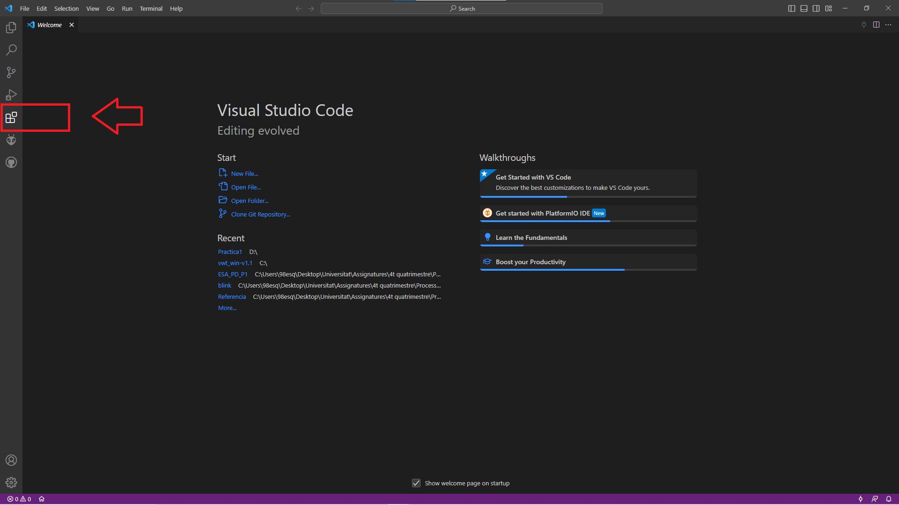
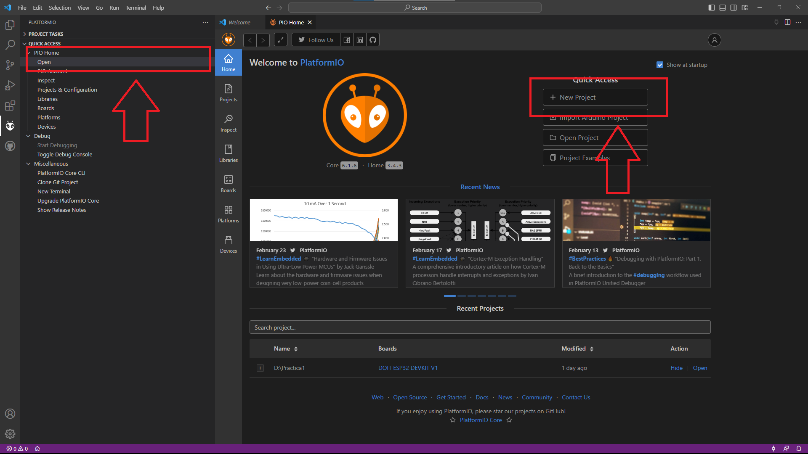
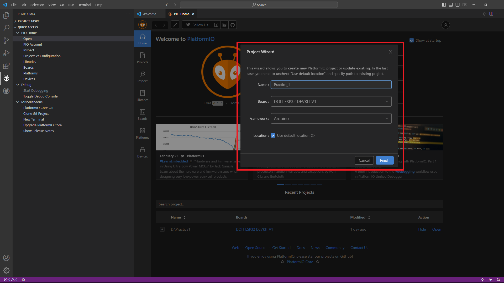
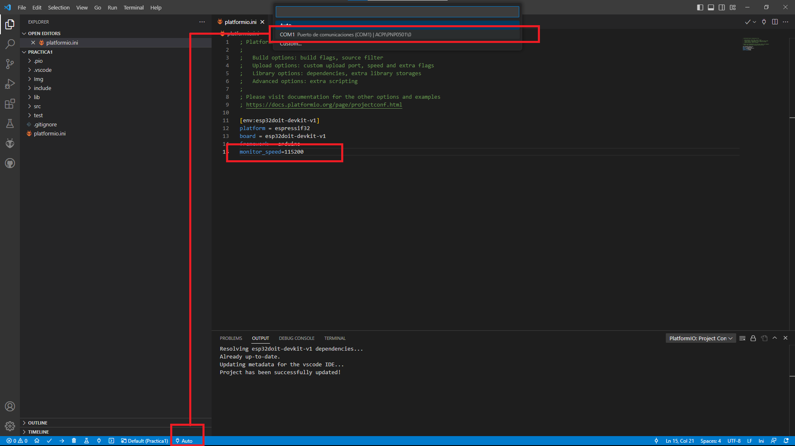
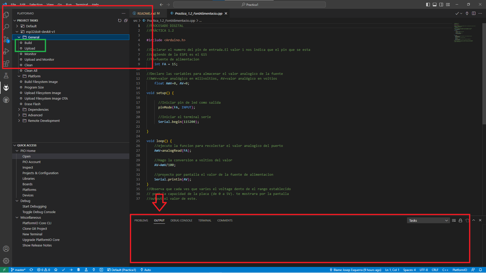

# Practica 1

## Indice

* Objetivo general
* Materiales
    -Hardware
    -Software
* Platformio
* Tasks
    - Led 
    - Oscioscopio
    - Fuente de alimentacion
    - Temperatura
* Subida a Github
* Respuestas
* Diagrama de flujo
* Diagrama de tiempos
* Conclusiones
___

## **Objetivo general**

</p> Bienvenidos a la primera practica del curso de **Processadores Digitales**. En esta primera session, aprendremos a iniciar un proyecto con platformio desde VS code, configurar nuestro miscroprocessador ESP32 al programa y a ejecutar algunos archivos Arduino programados.

---

## **Materiales**

### **Harware**

Para los materiales necesitaremos: 
- Ordenador...
- [Osciloscopio](https://www.amazon.es/Dingln-Pinzas-Cocodrilo-Osciloscopio-Prueba/dp/B08HV8J51B/ref=sr_1_6?__mk_es_ES=%C3%85M%C3%85%C5%BD%C3%95%C3%91&crid=27ZF7XABCXZQY&keywords=cable+bnc+osciloscopio&qid=1677279046&sprefix=cable+bcn+osciloscopio%2Caps%2C80&sr=8-6 "Ejemplo")
- [Cable de medicion BNC](https://www.amazon.es/Greluma-cables-prueba-clavija-cocodrilo/dp/B0BNXDHR21/ref=sr_1_5?keywords=cable+banana+cocodrilo&qid=1677278903&sprefix=cable+BANANA+coco%2Caps%2C82&sr=8-5 "Ejemplo")
- [Fuente de alimentacion](https://www.amazon.es/YUNRUX-alimentaci%C3%B3n-laboratorio-regulable-indicador/dp/B07S7TKT96/ref=sr_1_78?keywords=fuente+de+alimentacion+regulable&qid=1677278955&sprefix=fuente+de+al%2Caps%2C92&sr=8-78 "Ejemplo") regulable o bateria de Vmax=5V
- [Cable BANANA](https://www.amazon.es/Rigol-20-010-035-Osciloscopio-almacenamiento-digital/dp/B005ZPGPI6/ref=sr_1_24?adgrpid=148167204151&gclid=Cj0KCQiA3eGfBhCeARIsACpJNU_JnLArhi8Eu1wuPD76fwnG_0InSYpi80TciGn8RllWF-t7uT8MrN0aAm6aEALw_wcB&hvadid=645110332980&hvdev=c&hvlocphy=1005433&hvnetw=g&hvqmt=b&hvrand=12102152624187330744&hvtargid=kwd-296088521182&hydadcr=18582_2271486&keywords=precio+de+osciloscopio&qid=1677278845&sr=8-24 "ejemplo") con pinzas de cocodrilo (rojo para el voltage i negro para el GND)
- [Protoboard](https://www.amazon.es/AZDelivery-Breadboard-barras-conductoras-Arduino/dp/B07KKJSFM1/ref=asc_df_B07KKJSFM1/?tag=googshopes-21&linkCode=df0&hvadid=469836810464&hvpos=&hvnetw=g&hvrand=2475628720189313825&hvpone=&hvptwo=&hvqmt=&hvdev=c&hvdvcmdl=&hvlocint=&hvlocphy=1005433&hvtargid=pla-830808834908&psc=1 "Ejemplo")
- [x4 Cables duopont](https://www.amazon.com/Solderless-Multicolored-Electronic-Breadboard-Protoboard/dp/B09FP517VM "Ejemplo") male to male
- Cable MIN USB B macho

### **Software**

Para los programas necesitaremos: 
- Editor de lenguaje [Visual studio](https://code.visualstudio.com/ "official webpage")
- Extension de [Platformio](https://platformio.org/ "official webpage").
- Extension [gitHub](https://github.com/ "official webpage")
- Programa [Git](https://git-scm.com/ "official webpage")
- Lenguaje de programacion en uso: [Libreria Arduino](https://www.arduino.cc/reference/en/ "referencias/Funciones")

___

## **Platformio**

En este apartado se explica por encima como crear nuestro proyecto de ESP32 con platformio y como configurar nuestros puertos.

1. Abrir VS code, ir al apartado de Extensiones. En el explorador escribimos "Platofrmio" i intalamos la extension. (*puede tardar unos min.*)



2. Abriremos nuestra ventana de Platformio desde la barra de izquierda. Por defecto, nos encontraremos en la barra de tareas. De no ser asi, abrid "Pios Home/Open. Ya estais dentro de "platformio". Vas a la pestaña izquierda de Home si es que no estais por defecto y creais un nuevo proyecto directamente.  



3. En la pestaña para crear el proyecto os pediran una serie de cosas a declarar. Poneis un Nombre al proyecto,  especificais el tipo de placa que queries programar (en este caso sera una DOIT **ESP32 DEVKIT V1**) y como framework escogeis por defecto Arduino. Le damos a finish y el programa de por si nos creara los fixeros necessarios para ejecutar la programación del dispositivo Esp32.

> *"debeis declarar en que directorio quereis crear vuestro folder de proyecto antes de continuar..."*



4. Una vez creados los ficheros nos iremos directamente a modificais el **Monitor_speed** a una valor concreto (**de 115200**). El auto de la franga azul de abajo nos ayudara a localizar el puerto de conexion de nuestro ESP32 como esta indicado en la siguiente imagen. Asseguraos que el dispositivo este bien conectado al puerto USB de vuestro ordenador.

>*"Eso possible que el programa os pida que os instaleis unos driver."*



___

## **Tasks**

### **Led**

```C
//PROCESADO DIGITAL
//PRÀCTICA 1.1
#include <Arduino.h>

//Declarar el numero del pin de salida. El valor 1 nos indica que el pin que se esta 
//cogiendo de la ESP1 es el propio LED de la placa. 
  int impresion = 1;

void setup() {
  
      //Iniciar pin de led como salida
      pinMode(impresion, OUTPUT);

      //Iniciar el terminal serie
      Serial.begin(115200);

}

void loop() {

  //encender led
  digitalWrite(impresion, HIGH);

  //sacar por puerto serie mensaje ON
  Serial.println("ON");

  //espera de 500 milisegundos
  delay(500);

  //apagar led
  digitalWrite(impresion, LOW);

  //sacar por puesto serie mensaje OFF
  Serial.println("OFF");

  //espera de 500 milisegundos
  delay(500);

}
```

### **Oscioscopio**

```C
//PROCESADO DIGITAL
//PRÀCTICA 1.1.1
#include <Arduino.h>

//Declarar el numero del pin de salida. El valor 1 nos indica que el pin que se esta 
//cogiendo de la ESP1 es el G23
  int impresion = 23;

void setup() {
  
      //Iniciar pin de led como salida
      pinMode(impresion, OUTPUT);

      //Iniciar el terminal serie
      Serial.begin(115200);

}

void loop() {

  //enviar una señal de 5 voltios al osciloscopio
  digitalWrite(impresion, HIGH);

  //espera de 500 milisegundos
  delay(500);

  //enviar una señal de 0 voltios al osciloscopio
  digitalWrite(impresion, LOW);

  //espera de 500 milisegundos
  delay(500);

}
//En el Osciloscopio se tendria que observar como la señal toma forma de sierra
//De no ser asi, reduce la frequencia de muestra para poder observarla.
```

### **Fuente de alimentacion**

```C
//PROCESADO DIGITAL
//PRÀCTICA 1.2

#include <Arduino.h>

//Declarar el numero del pin de entrada.El valor 1 nos indica que el pin que se esta 
//cogiendo de la ESP1 es el G15
//FA=fuente de alimentacion
    int FA = 15;

//Declaro las variables para almacenar el valor analogico de la fuente
//AmV=valor analógico en milivoltios, AV=valor analógico en voltios
    float AmV=0, AV=0;  

void setup() {
  
      //Iniciar pin de led como salida
      pinMode(FA, INPUT);

      //Iniciar el terminal serie
      Serial.begin(115200);

}

void loop() {
    //ejecuto la funcion para recolectar el valor analogico del puerto
    AmV=analogRead(FA);
    
    //Hago la conversion a voltios del valor
    AV=AmV/100;
    
    //proyecto por pantalla el valor de la fuente de alimentacion
    Serial.println(AV);
}
//Observa que cada ves que varies el voltage dento de el rango establecido
// port la capazidad de la placa (de 0 a 5V). te mostrara por la pantalla
//output el valor de este.
```

### **Temperatura**

```C
//PROCESADO DIGITAL
//PRÀCTICA 1.3
#include <Arduino.h>

//Declaro la variable que recogera el valor de la temoperatura del 
//procesador en todo momento.
float temperature=0;

void setup() {
  
      //Iniciar el terminal serie
      Serial.begin(115200);
}

void loop() {

  ///ejecuto la funcion para recolectar el valor de temperatura del procesador
  temperature=temperatureRead();

  //sacar por puesto serie el valor de la temperatura
  Serial.println(temperature);
}
```
___

## **Arrancar el codigo**

Una vez escrito nuestro codigo en la carpeta **\src** del proyecto, simplemente nos iremos a la extension del **Platformio**. En el indize de la izquierda veres una lista de opciones en esquema. 

1. Para compilar el programa en vuestra placa, debeis selecionar la funcion **PROJECT TASKS\ [NOMBRE DE VUESTRA PLACA]"esp32doit-devkit-v1"\General\Build**. El proceso puede tardar unos min. Podeis ver el proceso en el panel de OUTPUT del VS code.

2. Despues, debeis arrancar el programa con la siguiente funcion **Upload**, debajo de **Build**. Los procesos (codigo de ejecucion, prints, output signals) del programa se veran en el panel **OUTPUT** de VS code.



___

## **Subida a Github**

Para subir nuestra creación a [GitHub](https://github.com "official webpage"), hos dejo un enlance a "dos" formas de proceder

1. Curso entero de GIT para aprender a subir ficheros a a internet de forma profesional "https://www.youtube.com/playlist?list=PLU8oAlHdN5BlyaPFiNQcV0xDqy0eR35aU"

2. Como sinconizar nuestro VS code con nuestra cuenta de Github
"https://www.youtube.com/watch?v=htstKtlFKeE"
___

## **Respuestas**


___

## **Diagrama de flujo**


___

## **Diagrama de tiempos**


___

## **Conclusiones**

> *----Esta primera experiencia con el procesado de señal a sido muy enriquezedora. No solo por el simple trabajo de la practica, sino en el hecho de tener que esforzarse. Es decir, tener que explorar por ti mismo las respuestas a qualquier problema planteado a la hora de afrontar el trabajo.*

> *----Desde crear el proyecto con Platformio, tener que aprender codigo C, Arduino, Git, la interación entre dispositivos con la placa ESP32 y procedecer con una forma de trabajo mas "profesional". És por eso que he creado una memoria entera del trabajo ejecutada paso a paso. Para tenerla a modo de Historial para el futuro*

___
